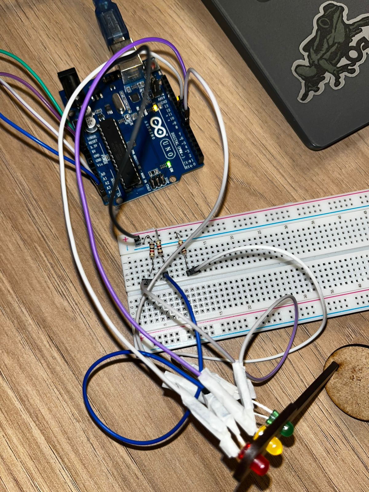
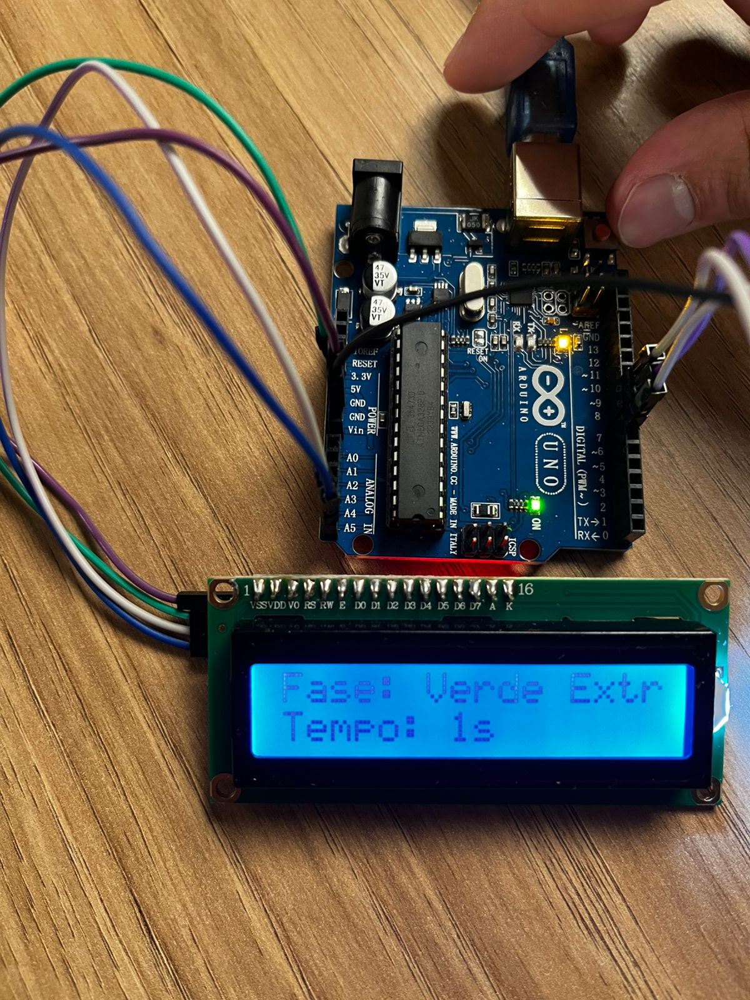

# Projeto: Semáforo com Arduino e Display LCD

Este é o meu projeto de semáforo utilizando um **Arduino Uno**.  
O sistema controla a sequência de LEDs vermelho, amarelo e verde e exibe o status e uma contagem regressiva em um display **LCD 16x2**.


## Funcionalidades

- Acende os LEDs de acordo com a sequência correta de um semáforo (**Vermelho → Verde → Amarelo**).  
- Mostra no LCD qual luz (fase) está acesa e o tempo restante.  
- Implementa ponteiros no código para o controle dos pinos (conforme desafio).


## Materiais Utilizados

| Componente       | Quantidade | Especificações            | Justificativa                                         |
|-----------------|------------|---------------------------|------------------------------------------------------|
| Arduino Uno      | 1          | Microcontrolador ATmega328P | Placa principal para controlar todo o circuito.     |
| LED vermelho     | 1          | Difuso, 5mm, 20mA         | Representa a luz "Pare" (vermelha) do semáforo.    |
| LED amarelo      | 1          | Difuso, 5mm, 20mA         | Representa a luz "Atenção" (amarela) do semáforo.  |
| LED verde        | 1          | Difuso, 5mm, 20mA         | Representa a luz "Siga" (verde) do semáforo.       |
| Resistor 1kΩ    | 3          | 1/4W, 5% tolerância       | Limita a corrente vinda do Arduino para cada LED.   |
| LCD I2C 16x2     | 1          | Módulo I2C PCF8574        | Mostra o status do semáforo de forma visual.       |
| Protoboard 830  | 1          |   830 pontos               | Permite a montagem do protótipo sem necessidade de solda. |
| Jumpers Macho-Fêmea | Vários  | —                         | Realiza as conexões elétricas entre os componentes. |

---

## Tutorial da Montagem

### 1. Conexão dos LEDs

Cada LED é conectado a uma porta digital do Arduino através de um **resistor de 1kΩ** para limitar a corrente.  
O lado mais longo do LED (**ânodo**) é o positivo (que recebe o sinal) e o lado mais curto (**cátodo**) é conectado ao GND.

- **LED Verde:** Conecte o ânodo ao pino digital 7 do Arduino (via resistor 1kΩ).  
- **LED Amarelo:** Conecte o ânodo ao pino digital 8 do Arduino (via resistor 1kΩ).  
- **LED Vermelho:** Conecte o ânodo ao pino digital 9 do Arduino (via resistor 1kΩ).  

Conecte o cátodo de todos os LEDs ao **GND** do Arduino.



**Justificativa:**  
Os pinos 7, 8 e 9 foram escolhidos por estarem em sequência, facilitando a organização.  
Os resistores são essenciais para proteger tanto os LEDs quanto as portas do Arduino.

---

### 2. Conexão do LCD I2C

O módulo I2C facilita muito a conexão do LCD, usando apenas 4 fios:

- GND do LCD → GND do Arduino  
- VCC do LCD → 5V do Arduino  
- SDA do LCD → pino analógico A4 do Arduino  
- SCL do LCD → pino analógico A5 do Arduino  



**Justificativa:**  
O protocolo I2C (pinos A4 e A5 no Uno) permite a comunicação com o display usando apenas dois fios de dados, liberando as outras portas digitais para os LEDs.


## Demonstração em Vídeo

Assista ao vídeo do projeto montado e em funcionamento no link abaixo:  

▶️ [Assistir ao vídeo da montagem e funcionamento](https://drive.google.com/file/d/1GsnsAoV50aGaHzbxbgoiei3MkEbsiEWj/view?usp=drive_link)  

> Nota: O vídeo demonstra o funcionamento do semáforo com os tempos corretos e o autor aparece na gravação para comprovar a autoria.


## Código do Arduino

```cpp
#include <LiquidCrystal_I2C.h>
#include <Wire.h>

// Inicializa o LCD no endereço 0x27 com 16 colunas e 2 linhas
LiquidCrystal_I2C lcd(0x27, 16, 2);

// Variáveis dos pinos
int red = 9;
int yellow = 8;
int green = 7;

// Ponteiros para os pinos
int *pRed = &red;
int *pYellow = &yellow;
int *pGreen = &green;

void setup() {
  lcd.init();
  lcd.backlight();
  lcd.setCursor(0, 0);
  lcd.print("Semaforo Iniciado");

  // Configura os pinos dos LEDs como saída usando os ponteiros
  pinMode(*pRed, OUTPUT);
  pinMode(*pYellow, OUTPUT);
  pinMode(*pGreen, OUTPUT);

  delay(2000);
}

void loop() {
  // Fase VERMELHO
  digitalWrite(*pRed, HIGH);
  digitalWrite(*pYellow, LOW);
  digitalWrite(*pGreen, LOW);
  contagem("Vermelho", 6); // Tempo: 6 segundos

  // Fase VERDE
  digitalWrite(*pRed, LOW);
  digitalWrite(*pYellow, LOW);
  digitalWrite(*pGreen, HIGH);
  contagem("Verde", 4); // Tempo: 4 segundos

  // Fase AMARELO
  digitalWrite(*pRed, LOW);
  digitalWrite(*pYellow, HIGH);
  digitalWrite(*pGreen, LOW);
  contagem("Amarelo", 2); // Tempo: 2 segundos
}

//Função para exibir a fase no LCD e fazer a contagem regressiva

void contagem(const char* fase, int segundos) {
  lcd.clear();
  lcd.setCursor(0, 0);
  lcd.print("Fase: ");
  lcd.print(fase);
  
  for (int i = segundos; i > 0; i--) {
    lcd.setCursor(0, 1);
    lcd.print("Tempo: ");
    lcd.print(i);
    lcd.print("s  "); // Espaços extras para limpar contagens anteriores
    delay(1000);
  }
}
